# OSB - POC de uso de submódulos

Esta POC tem a intenção de demonstrar vantagens e desvantagens do uso de [submódulos](https://git-scm.com/book/en/v2/Git-Tools-Submodules). Para tal são usados 3 repositórios:

- osb: Repositório que usará os submódulos
- osb-core (submodulo): Repositório que representa o osb-core real
- osb-portal (submodulo): Repositório que representa o osb-portal real

## Vantagens e desvantagens

- Vantagens:

  - (principal) Permite a entrega tanto de um grande produto muito complexo quanto dos produtos que lhe compõem.
  - Permite a "dockerização" dos componentes de um produto complexo.
  - Estruturação mais coerente de um produto complexo.
  - Maior coesão de commits e PR's.
  - Resumo: Permite o aproveitamento das vantagens das abordagens de multi e mono repo.

- Desvantagens:
  - (principal) Defasagem: Submódulos são referências à um commit em um repositório, o que pode tornar o repositório com submódulos defasado e a autalização dos submódulos é feita de forma manual.
  - Adiciona complexidade no aspecto infraestrutural por adicionar mais um repositório para ser mantido.
  - Aumento da complexidade no gerenciamento do projeto por requerir o acompanhamento não de um produto, mas de vários (sub)produtos.
  - Resumo: Torna mais complicadas a manutenção e o gerenciamento de um produto/projeto.

## Como utilizar submódulos

1. Criar do repositório onde ficarão os submódulos (chamarei repositório pai).

   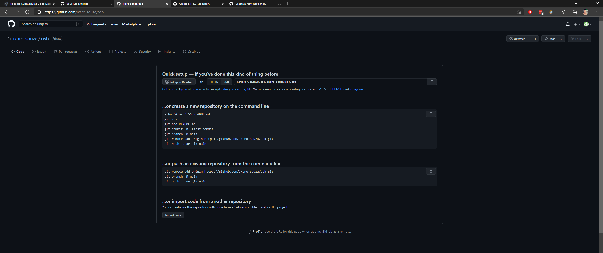

2. Criar os repositórios que serão submódulos (chamarei somente de submódulos).

   osb-core
   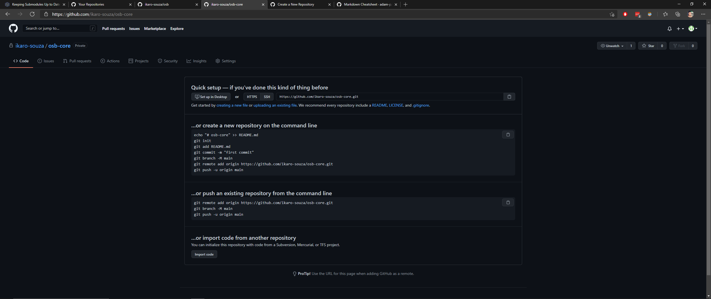

   osb-portal
   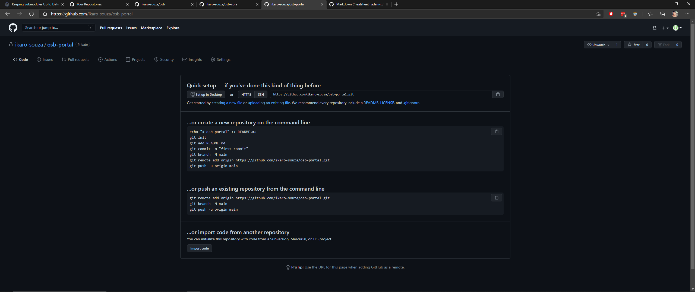

3. Clonar e realizar primeiro commit nos submódulos.

   osb-core clonado e commitado
   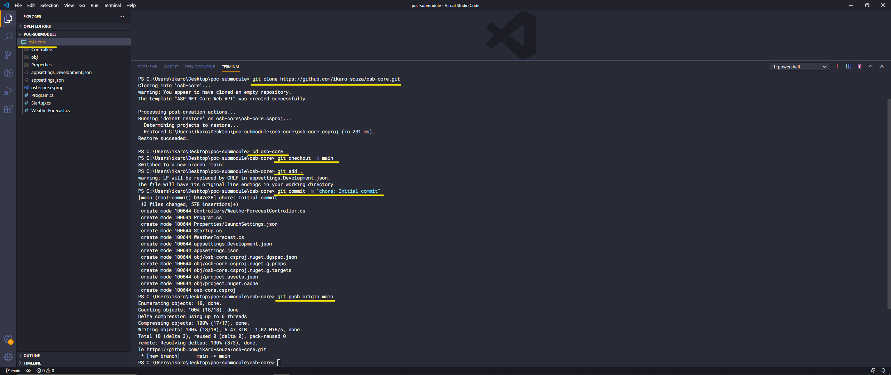

   osb-core no github
   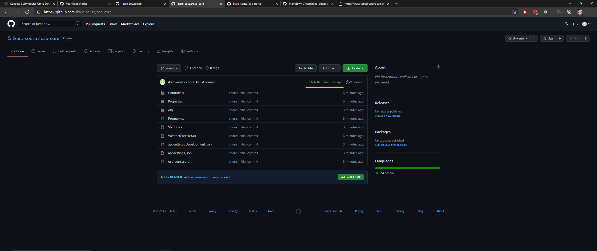

   osb-portal clonado e commitado
   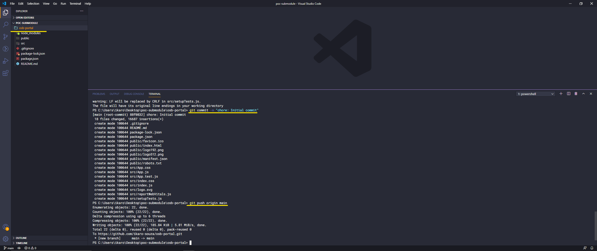

   osb-portal no github
   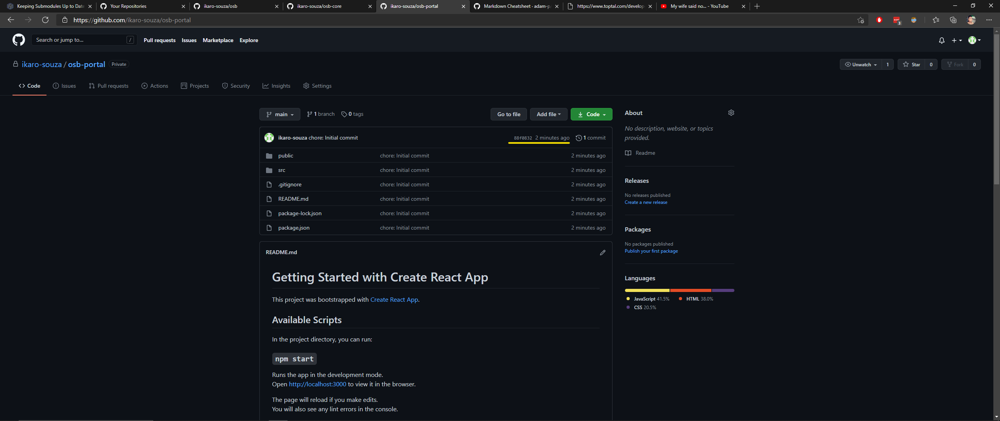

4. Clonar repositório pai e adicionar submódulos.

   osb clonado e com submódulos
   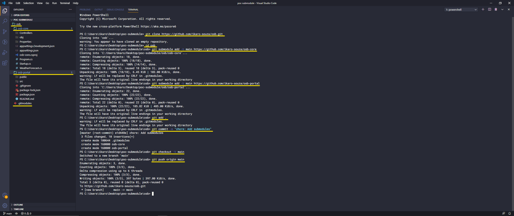

   osb no github
   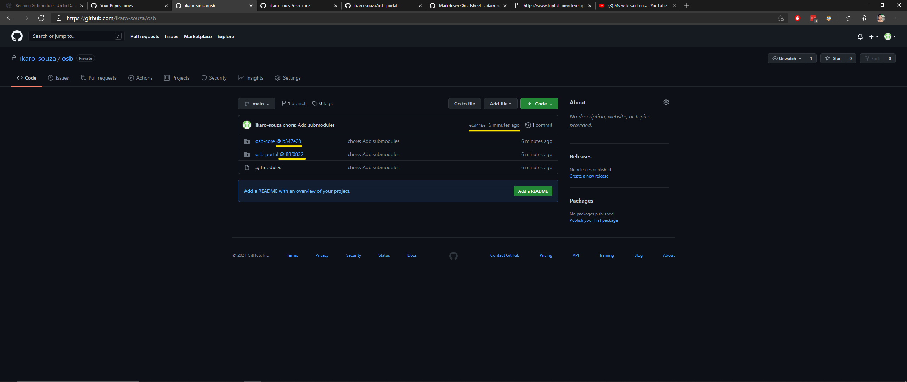

5. Atualizar submódulos.

   osb-core atualizado
   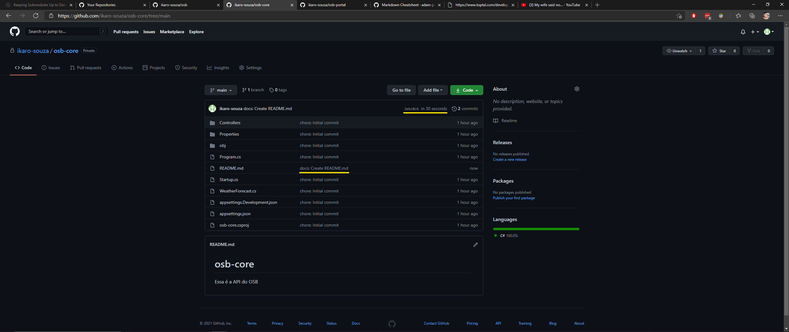

   osb-portal atualizado
   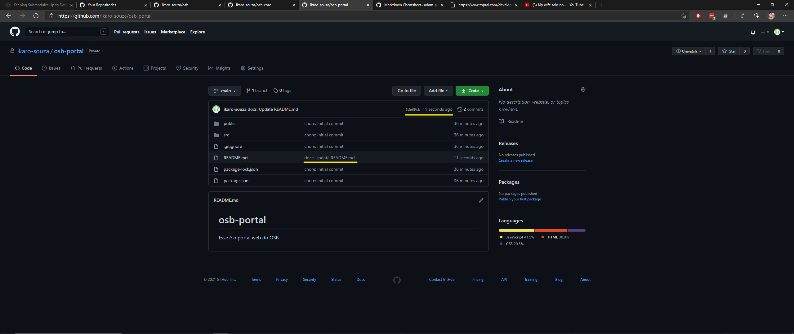

6. Atualizar referências dos submódulos no repositório pai.

   comandos para atualização do repositório pai
   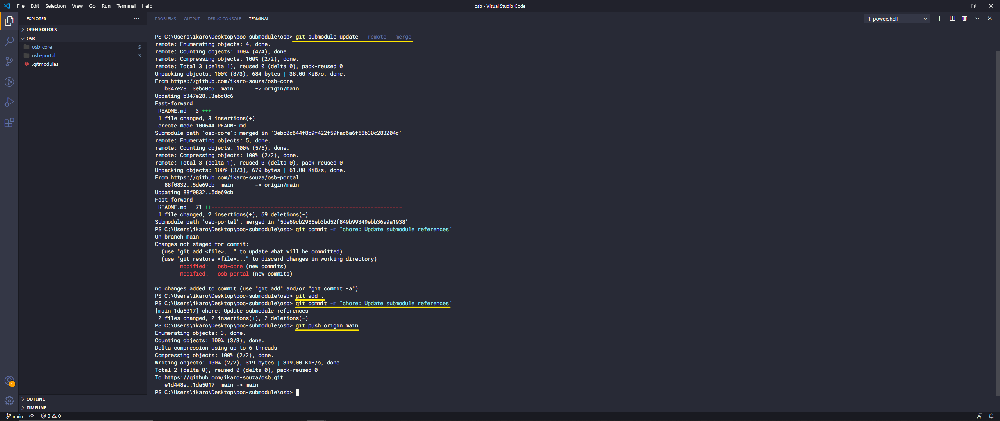

   repositório pai atualizado
   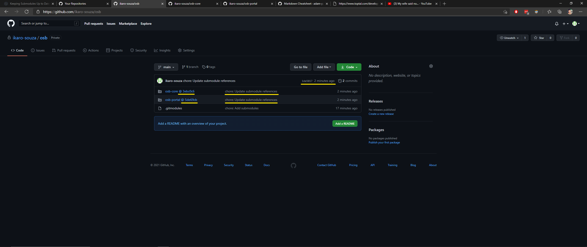

## Clonar repositório que já contém submódulos

Para clonar um repositório com seus submódulos, é necessário adicionar a flag `--recursive` ao comando `git clone`, ficando assim: `git clone --recursive url`. No exemplo da imagem há também a flag `-j2`, ela determina em quantas threads o comando `git clone` será executado, o uso dessa flag é opcional.

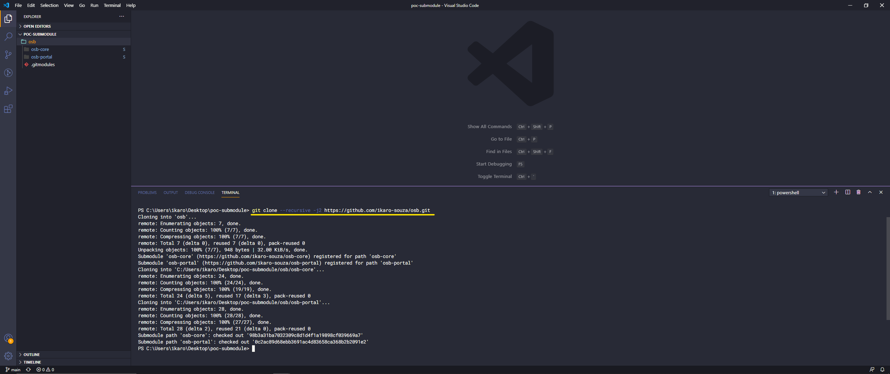

## Executando o projeto de exemplo

Tanto os submódulos quanto o repositório com submódulos estão configurados para serem debuggados pelo VSCode, então basta abrir o projeto e apertar F5 👍.
